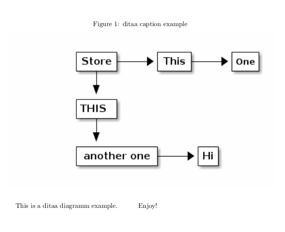

= The LaTeX ditaa package

With this, you will not need to bring your diagrams outside your  `.tex` file and not to worry about wiring such files for diagrams, and tools (Microsoft Visio, PowerPoint, Libre Office tools, as such) from which they are created.

....
\begin{ditaa}{ditaa caption example}{ditaaexample}
    +-----+     +----+     +---+
    |Store+---->|This+---->|One|
    +--+--+     +----+     +---+
       |
       V
    +-----+
    |THIS |
    +--+--+
       |
       V
    +-----------+     +--+
    |another one+---->|Hi|
    +-----------+     +--+
\end{ditaa}
....

The source above will be converted into a following diagram and incorporated in your final PDF.

.Figure Rendered Ascii Art
[#img-sunset]
[caption="Figure 1: ",link=resources/rendered.png]

== Prerequisites
* You need to have http://ditaa.sourceforge.net/[ditaa] installed. (Need to be able to run `ditaa` from your command line). Fortunately, recent package managers such as `apt` allow you to install it with a single command line `sudo apt install ditaa`. `brew` let me do similar `sudo brew isntall ditaa` on my mac. For windows, sorry, please let me know how to do that...
* You need to give an option `--shell-escape` to your LaTeX compiler (such as `pdflatex`, `latex`, etc) command whichever you use.

== How to use

* Place the `ditaa.sty` file at the same directory as your `.tex` file. (This step will not be necessary, if `latex-ditaa` is available from CTAN)
* Create `ditaa` directory under the directory you have for the other non-ditaa images. This package will create `.ditaa` and `.png` files here.
* Do `usepackage[imagepath=IMAGEPATH]{ditaa}` beffore `\begin{document}`. The IMAGEPATH is the directory you have images.
* Compile your  `.tex` files as usual, but giving  `--shell-escape` option to your `(pdf)latex` command.

Typically, run `mkdir ./resources/graphics` and do following in your .tex file.
....
\def\imagepath{./resources/graphics}
\usepackage[imagepath=\imagepath]{ditaa}
\graphicspath{ {\imagepath/} }
....

Then compile your file with `pdflatex --shell-escape`.

== Options

* Use https://github.com/stathissideris/ditaa that support SVG

Its supported options are as follow (summed up) :

....
% Turns anti-aliasing off
-A,--no-antialias

% The background colour of the image
-b,--background <BACKGROUND>

% Renders the debug grid
-d,--debug

% Prevents the separation of common edges
-E,--no-separation

% The encoding of the input file
-e,--encoding <ENCODING>

% The input is an HTML file
-h,--html

% Prints usage help
--help

% Image file is overwriten
-o,--overwrite

% All corners to be rendered as round corners
-r,--round-corners

% Turns off the drop-shadow effect
-S,--no-shadows

% Size of the rendered image
-s,--scale <SCALE>

% SVG image as destination file
--svg

% SVG font URL
--svg-font-url 

% Diagram rendered on a transparent background
-T,--transparent

% Tabs interpreted as x spaces
-t,--tabs <TABS>

% Makes ditaa more verbose
-v,--verbose

% Sides of parallelograms as fixed slope
-W,--fixed-slope
....

Cannot be specified on a group basis, only in the preamble. 
Just add the requested parameters without the leading/separator dash(es). 

[source,latex]
----
\usepackage[S]{ditaa}
----

or :

[source,latex]
----
\usepackage[noshadows, svgfonturl={carlito-regular-webfont.svg}]{ditaa}
----

== Tips
Online sites such as http://stable.ascii-flow.appspot.com/#Draw[ascii-flow] will be your friends!

== Future Works
* I want to use this in OverLeaf. Publish in CTAN? Help me. I'm a LaTeX newbie.

== References
* https://github.com/deselaers/latex-beamerposter[latex-beamerposter]: I learned a lot from this; such as how to package my .sty, how to organize directories under my repo for LaTeX style package, etc.
